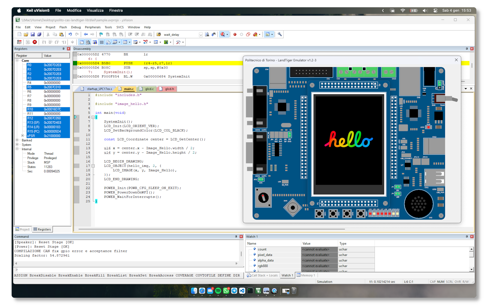
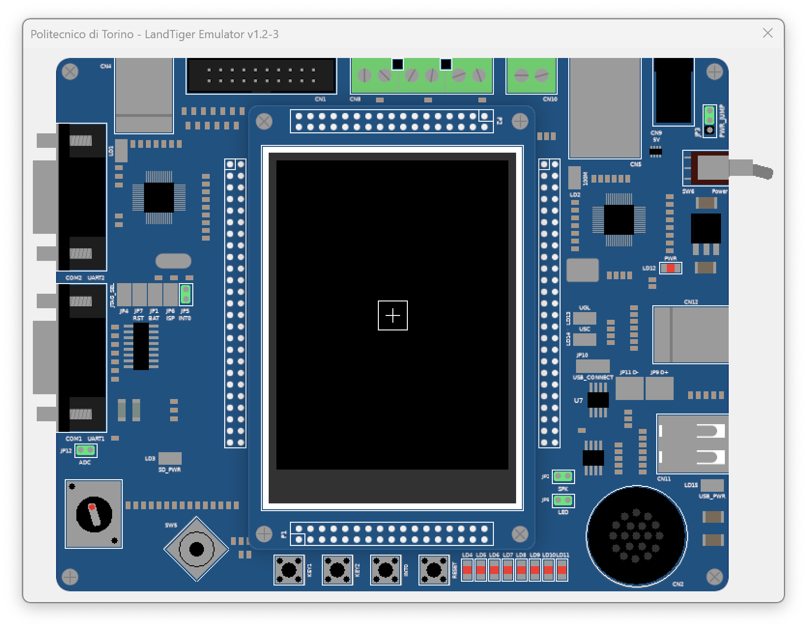
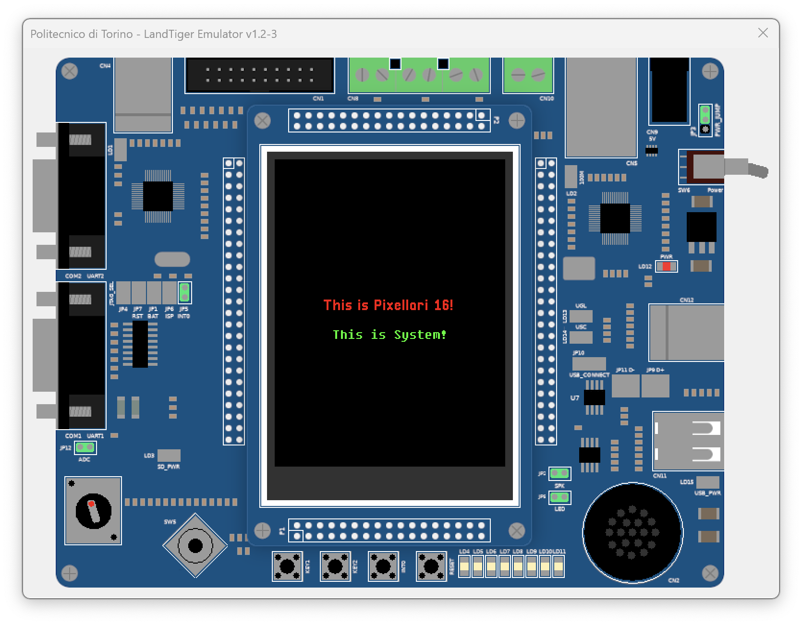
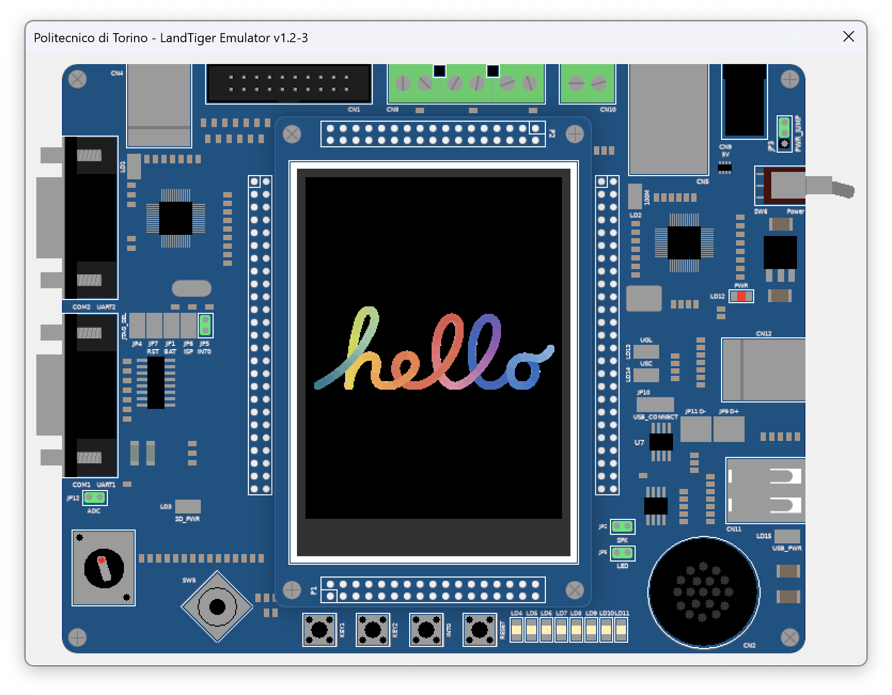

# Custom Peripherals Library for the LandTiger LPC1768 Board

[](https://fabcolonna.github.io/polito-cas-landtiger-lib/)



## What's this?

This is a Keil uVision 5 project for developing a **custom C interface for every peripheral of the LandTiger LPC1768** board, introduced during the course of **Computer Architectures**, taught in the MSc Computer Engineering program at Politecnico di Torino. Why did I create this? Mainly because I wanted to deeply understand how complex things that we take for granted, such as drawing on the screen or playing audio, work at the bare metal level. At the same time, I wanted to provide a more abstract and powerful interface for the user, so that they can focus on the application logic, rather than on the low-level details.

The interface is distributed as a **library** and it's available in the *Releases* section of this repository. It's meant to be included in your Keil projects (see below for instructions on how to do this). It's still in development, and I'm the only one working on it, so you may encounter bugs or unexpected behavior. I'm doing my best to keep the code clean and well-documented, so that you can understand how it works and how to use it.

### Repo structure

- `Keil/`: contains the Keil project;
  - `Objects`: contains the compiled library, in the form of a `.lib` file;
  - `Tests`: contains the test programs used to test the library's functions during development;
  - `Source`: contains the source code:
    - `CMSIS_Core`: CMSIS (Cortex Microcontroller Software Interface Standard) core files;
    - `Libs`: the library, with a folder for each peripheral;
    - `System`: contains the system startup code for the LPC1768, alongside the `system.h` file, which is required when building programs as it defines both the SystemInit() function for initializing the controller, and some other necessary define directives.
- `Scripts/`: contains the Python scripts used to generate C buffers from displaying images and rendering fonts (more on this later).

### Software

I developed the library using both Visual Studio Code and Keil uVision 5. The former was used for writing code, while the latter  to run tests and debug the it. The `peripheral.uvprojx` file is the Keil project file, and it defines three targets:

- `library`: compiles the library without the testing folders, and produces a `.lib` file in the `Keil/Objects/` directory;
- `test-sim`: produces an executable from every source file in the Source Group, and runs it using the simulator;
- `test-dev`: produces an executable from every source file in the Source Group, and runs it on the physical board.

### Scripts

There are some bash/batch scripts in the root directory that I use to automate some tasks. Here's a list of them:

- `lib-mk.sh`: moves the `.lib` file created by Keil into a directory alongside the `Include/` directory, in which every header file is copied. This is necessary, otherwise users won't be able to use the library in their projects;
- `lib-rel.sh`: sets up a new Release on GitHub, by creating a new tag, pushing it to the remote repository, and uploading the `.lib`, which is then deleted from the local machine.
- `doxy-up.sh`: generates the Doxygen documentation and pushes it to the `gh-pages` branch, which is automatically deployed as a GitHub Page. The documentation is available by clicking on the badge at the top of this README.

## Current status of the project

The library currently supports the following peripherals. More complex interfaces will be described more in depth in the dedicated sections below.

- [X] Buttons (with optional debouncing)
- [X] Timers
- [X] RIT
- [X] SysTick Timer control (not refined)
- [X] Power Management
- [X] LEDs
- [X] Joystick
- [X] ADC for potentiometer support
- [X] DAC Tone Generator with buzzer
- [X] GLCD & TouchScreen for the ADS7843 controller
- [ ] CAN Bus

### GLCD in depth: rendering objects

I put *a lot* of effort into the GLCD interface, as it's certainly one of the most complex peripherals to interface with. In fact, it must be flexible enough to support different actions that the user could find useful (like drawing images, text, etc.), but also simple enough to be used without too much hassle.

The current status of the interface is already quite enough: it supports basic components, like text, images and shapes, and provides a **declarative** syntax to use them to create more complex objects, made of more than one component. The rendering is performed using a render queue, in which items are added and removed by the user, through a very intuitive interface. As of now, the render queue is statically allocated, hence its size is fixed to **1024** components. I opted for this solution to keep the overhead low (which would have been surely much higher with dynamic memory allocation). I plan to implement a more sophisticated system in the future though, with the goal of removing this limitation.

#### How to render stuff

First of all, you need to initialize the GLCD by calling the `LCD_Init(LCD_Orientation)` function in your `main()`. The LCD must be initialized before doing anything else (even the touch controller requires it, as it uses the LCD to draw the calibration interface!).

To display objects on the GLCD, you can use the various functions and macros provided. Here are some of the key functions and macros that you'll use:

**Functions**:

- `LCD_SetPointColor(LCD_Color color, LCD_Coordinate point)`: Sets the color of a specific pixel;
- `LCD_SetBackgroundColor(LCD_Color color)`: Tells the interface the color of the background that will be rendered *upon* clearing the screen, then clears the screen and redraws the object with the new background color.
- Other functions for retrieving information about the screen, like `LCD_GetWidth()`, `LCD_GetHeight()`, `LCD_GetCenter()`, etc.

Here are some functions related to rendering:

- `LCD_RQAddObject(const LCD_Obj *const obj)`: Adds an object to the render queue and returns its ID. If you use the `LCD_BEGIN_DRAWING` and `LCD_END_DRAWING` macros when building drawable components, you don't need to call this function manually;
- `LCD_RQRemoveObject(LCD_ObjID id, bool redraw_screen)`: Removes an object from the render queue using its ID;
- `LCD_RQSetObjectVisibility(LCD_ObjID id, bool visible, bool redraw_screen)`: Shows or hides an object.

**Drawing components**:

Components are the basic building blocks of objects. While the library allows you to declare component directly using the type `LCD_Component`, I highly recommend using the macros described below, that hide the complexity of the structure, making the code more readable.

- `LCD_LINE(...)`: Defines a line component;
- `LCD_RECT(x, y, ...)`: Defines a rectangle component with the top-left corner at `(x, y)`;
- `LCD_CIRCLE(...)`: Defines a circle component;
- `LCD_IMAGE(x, y, image_struct)`: Defines an image component with the top-left corner at `(x, y)`, using the `image_struct` structure generated by the Python script `img2c.py`;
- `LCD_TEXT(x, y, ...)`: Defines a text component with the top-left corner at `(x, y)`.

**Declarative object definition**:

A component cannot be rendered on the screen by itself. It must be part of an **object**, which is a collection of components (or only one). Declaring an object is not trivial, as it requires the user to define the various components, and to manage the data structures that store them (without the risk of having dangling pointers all over the place). To avoid problems of these kind, and maintain a clean code, I introduced a set of macros that simplify the process of defining, and rendering them:

- `LCD_OBJECT(name, num_comps, ...)`: Declares an object, made up of `num_comps` components, ready to be rendered on the screen. At the end, it adds the object to the render queue, and returns its ID;

- `LCD_BEGIN_DRAWING` and `LCD_END_DRAWING`: These macros are used to wrap the drawing code. The `LCD_END_DRAWING` macro automatically triggers a screen update, effectively rendering the object(s) that they contain.

#### `main()` example: drawing a cross

This is the code for drawing a simple cross on the screen:

  ```c
#include "includes.h"

int main(void)
{
    SystemInit();
    LCD_Init(LCD_ORIENT_VER);
    LCD_SetBackgroundColor(LCD_COL_BLACK);

    LCD_ObjID cross_id;
    u16 x = LCD_GetWidth() / 2;
    u16 y = LCD_GetHeight() / 2;

    LCD_BEGIN_DRAWING;
    cross_id = LCD_OBJECT(cross, 3, {
        LCD_RECT(x - 15, y - 15, {
            .width = 30,
            .height = 30,
            .edge_color = LCD_COL_WHITE,
            .fill_color = LCD_COL_NONE,
        }),
        LCD_LINE({
            .from = {x, y - 7},
            .to = {x, y + 7},
            .color = LCD_COL_WHITE,
        }),
        LCD_LINE({
            .from = {x - 7, y},
            .to = {x + 7, y},
            .color = LCD_COL_WHITE
        }),
    });
    LCD_END_DRAWING;

    POWER_Init(POWR_CFG_SLEEP_ON_EXIT);
    POWER_PowerDownOnWFI();
    POWER_WaitForInterrupts();
}
  ```

This produces the following output:



### GLCD in depth: custom fonts

The GLCD has 2 built-in fonts that can be used to render text, `LCD_DEF_FONT_SYSTEM` and `LCD_DEF_FONT_MSGOTHIC`. The problem with these fonts is that the user has no control over the characters' size, and there might be cases where it's necessary to draw smaller or bigger text. That's why I introduced the possibility to load **custom fonts**, with **custom sizes**!

Before diving into the details, let's talk about limitation. As of now, you can load up to **16** different font in the GLCD, and each font can only have **ASCII characters**. This may change in the future, but for now, this is how it is.

#### How to load custom fonts

That's not as straightforward as it may seem, and that's because, like I said before, the current implementation **does not have support for file-system**, and this prevents us from reading font files directly. The only ability we have (for now!) is to load stuff as C buffers, and that's what we're going to do.

As the name suggests, the Python script `ttf2c.py` converts a TrueType font file (`.ttf`) into a C buffer that can be included in the project and used by the library's functions. It accepts a size, so multiple arrays can be generated for different sizes of the same font. After running it, you'll get a output file containing the following:

- An array containing the font data (in terms of pixels to be drawn for each character);
- An array containing the individual characters' width, that is used to correctly space the single chars while rendering a string;
- A structure of type `LCD_Font`, which contains the font's metadata, like the width and height of the characters, and a pointer to the arrays described above. This is **the only thing that the user needs** to use explicitly in the project.

Here's an example of the structure described above, for the Pixellari font (size 16):

```c
const LCD_Font Font_Pixellari16 = {
    .data = Font_Pixellari16Data,
    .data_size = 95,
    .char_widths = Font_Pixellari16CharWidths,
    .max_char_width = 14,
    .char_height = 14,
};
```

You don't need to worry about any of this stuff, because loading the font is as simple as:

- Moving the output file to the `Program/Fonts/` directory;
- Including it in the `main.c` file;
- Calling the `LCD_FMAddFont(<LCD_Font>)` with the name of the structure as argument.

The function returns the font's ID, which you can use to render text with that font (the `.font` field of the `LCD_Text` structure), and to unload it when you don't need it anymore, with the `LCD_FMRemoveFont(<font_id>)` function.

#### `main()` example: `pixellari.ttf`

Below is an example of how to load a bitmap font (Pixellari) downloaded from [DaFont](https://www.dafont.com/) and use it to display a string:

```c
#include "includes.h"
#include "font_pixellari16.h"

int main(void)
{
    SystemInit();
    LCD_Init(LCD_ORIENT_VER);
    LCD_SetBackgroundColor(LCD_COL_BLACK);

    const LCD_Coordinate center = LCD_GetCenter();
    const LCD_FontID pix16_fid = LCD_FMAddFont(Font_Pixellari16);

    LCD_BEGIN_DRAWING;
    LCD_OBJECT(text_obj, 2, {
        LCD_TEXT(center.x - 70, center.y - 15, {
            .text = "This is Pixellari 16!",
            .text_color = LCD_COL_RED,
            .bg_color = LCD_COL_NONE,
            .font = pix16_fid,
        }),
        LCD_TEXT(center.x - 60, center.y + 15, {
            .text = "This is System!",
            .text_color = LCD_COL_GREEN,
            .bg_color = LCD_COL_NONE,
            .font = LCD_DEF_FONT_SYSTEM,
        }),
    });
    LCD_END_DRAWING;

    LCD_FMRemoveFont(pix16_fid);
    POWER_Init(POWR_CFG_SLEEP_ON_EXIT);
    POWER_PowerDownOnWFI();
    POWER_WaitForInterrupts();
}
```

This produces the following output:



### GLCD in depth: image rendering

Just like fonts, the GLCD interface also supports drawing images, in the form of C buffers generated by the Python script `img2c.py`. The script accepts any kind of image as input, and generates:

- C buffer of **RLE-encoded** 32 bit values for (A)RGB information (A is optional, it's included only if the image has *meaningful* alpha data, i.e. it's not constant at `0xFF`);
- a structure of type `LCD_Image`, which is the only thing that the user needs to use explicitly in the project, and contains image metadata, like the width and height of the image, and a pointer to the array containing the pixel data.

In the current implementation, the alpha channel is only used to choose whether to draw the pixel or not. In other words, alpha blending is not supported: any given pixel is either **fully opaque or fully transparent**. I plan to implement a more sophisticated system in the future though, with the goal of supporting background & foreground blending.

> **Note**: Keep in mind that the GLCD driver can only handle **16 bits per pixel**. This means that the image will be **downsampled** from 24/32 bits to 16 bits. This can potentially lead to a loss of color information.

#### How to display images

Here's an example of structure generated by the script, for the following image that's been resized to 200x60 pixels (yeah, the script can do that too! 😁):

<html>
    <p align="center">
        
    </p>
</html>

```c
const LCD_Image Image_Hello = {
    .pixels = Image_HelloData,
    .width = 200,
    .height = 60,
    .has_alpha = true
};
```

You can then display the image by:

- Moving the output file to the `Program/Assets/` directory;
- Including it in the `main.c` file;
- Creating an object with an `LCD_IMAGE` component inside (and something else, if you want), just like we saw in the Rendering section.

Just like any other component, you'll get an ID that you can use to remove the image from the render queue, or to change its visilibity.

#### `main()` example: displaying the *Hello* image

```c
#include "includes.h"
#include "image_hello.h"

int main(void)
{
    SystemInit();
    LCD_Init(LCD_ORIENT_VER);
    LCD_SetBackgroundColor(LCD_COL_BLACK);

    const LCD_Coordinate center = LCD_GetCenter();
    u16 x = center.x - Image_Hello.width / 2;
    u16 y = center.y - Image_Hello.height / 2;

    LCD_BEGIN_DRAWING;
    LCD_OBJECT(hello_img, 2, {
        LCD_IMAGE(x, y, Image_Hello),
    });
    LCD_END_DRAWING;

    POWER_Init(POWR_CFG_SLEEP_ON_EXIT);
    POWER_PowerDownOnWFI();
    POWER_WaitForInterrupts();
}
```

This produces the following output:



Amazing, isn't it? 😁 Well, as you can see there are some artifacts due to unoptimal alpha handling, but I look forward to improving it very soon!

### GLCD roadmap

The GLCD interface is still in development, and there are a lot of features that I'd like to implement, eventually. Here's a list of what I have in mind:

- [X] Drawing RGB and RGBA images from C buffers;
- [ ] Full support for alpha blending;
- [X] Implement a rendering queue and the concept of object;
- [X] Support for custom fonts loaded as C buffers;
- [ ] Support for object alignment (e.g. centering text, images), to avoid having to calculate the position manually;
- [ ] Memory arena for the render queue, to let the user decide how much memory to allocate for the GLCD based on the application's needs and the available memory, thus removing the static limitation of 1024 components and the need to statically allocated memory for the objects and components to avoid dangling pointers;

### DAC in depth

Nothing too fancy here, but not for long! TTYL when I'll figure out how to play music with this thing. 😁

### DAC roadmap

- [ ] A way to play music through the DAC, like PCM data from a WAV file, instead of just pure sinusoidal tones;
- [ ] Offloading the DAC timing to other entities other than the standard timers, so that they can be used for other purposes by the user;

## General roadmap

In addition to the GLCD and DAC roadmaps, I have some other features in mind that I'd like to implement in the future:

- [X] RIT that accepts tasks through callback functions, possibly with different timings;
- [ ] A more general-purpose interface for ADC (support for other channels, etc.);
- [ ] Support for file systems and SD cards, for reading actual files, instead of C buffers, like fonts, images or audio;
- [ ] Support for prolonged joystick actions;

**Not immediately planned**:

- [ ] Ethernet support for network communication;
- [ ] A more comprehensive support for SysTick;

---

## How to use the library in your projects

This branch is meant to be used for library development and testing. If you want to use the library in your own projects, you should download the **sample project** that I created from the `sample-project` branch of this repository.

It contains a fully configured Keil project that uses the library, and includes two targets: one for the simulator, and one for the physical board. Both require the library to be included in the `Keil/Libs/Peripherals` directory in the project's root.

### Retrieving the library

In the root directory, run the `get-latest-peripheral-lib.sh` script. This will download the latest release of the library, and extracts it directly in the `Keil/Libs/Peripherals` directory.

### Project structure

The project is structured as follows:

- `Keil`: contains the Keil project;
  - `Libs/`: contains every library used by the project (e.g. this one!)
  - `Source/`:
    - `System/`: contains the system startup code for the LPC1768, alongside the `system.h` file, which is required when building programs as it defines both the SystemInit() function for initializing the controller, and some other necessary define directives;
    - `Program/`: contains the source code of your program, alongside other directories:
      - `Assets/`:
        - `Fonts/`: contains the custom fonts used by the program;
        - `Images/`: contains the images used by the program;

- `Scripts/`: contains the Python scripts described in the previous sections, used to generate C buffers from displaying images and rendering fonts.

**Happy coding! 😁**

---

## Contributing to the library

I'm open to contributions, since I'm currenty the only one working on it. I'll define a set of guidelines for contributing in the future, if the project gains traction. For now, if you want to help me, plase open an issue and we can discuss the feature you want to implement, and how to do it.

## License

This project is licensed under the MIT License. For more information, please refer to the LICENSE file.
